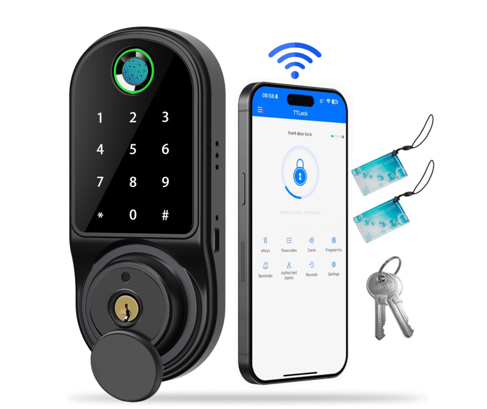
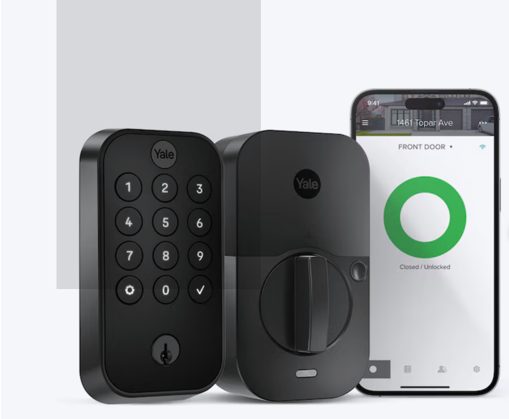

## Voice of the Customer Benchmarking Example

## Search #1

**Keywords:** "smart door sensor" on Google.com

**Search Results Link:** [https://www.google.com/search?sca_esv=cdd4458fa27f824d&rlz=1C1VDKB_enUS1093US1093&sxsrf=AE3TifMkpY1gexsF5ayPDJEhy27Zu6m1mQ:1757987142256&q=smart+door+sensor&source=lnms&fbs=AIIjpHxU7SXXniUZfeShr2fp4giZ1Y6MJ25_tmWITc7uy4KIeioyp3OhN11EY0n5qfq-zEMZldv_eRjZ2XLYc5GnVnME7glWodDcaQwvGYJtospyF4hao4VocMoniUVvlzzwRcAutntzzMkpzL1o5CSBDD8I2LFmZthekWYMSoJkRUd-qkF-YfrLLnbTB66EUfmOKya3Ca_s42egkD0HBUwwnnRIONWNCg&ved=1t:200715&ictx=111&biw=1707&bih=772&dpr=1.13](https://www.google.com/search?sca_esv=cdd4458fa27f824d&rlz=1C1VDKB_enUS1093US1093&sxsrf=AE3TifMkpY1gexsF5ayPDJEhy27Zu6m1mQ:1757987142256&q=smart+door+sensor&source=lnms&fbs=AIIjpHxU7SXXniUZfeShr2fp4giZ1Y6MJ25_tmWITc7uy4KIeioyp3OhN11EY0n5qfq-zEMZldv_eRjZ2XLYc5GnVnME7glWodDcaQwvGYJtospyF4hao4VocMoniUVvlzzwRcAutntzzMkpzL1o5CSBDD8I2LFmZthekWYMSoJkRUd-qkF-YfrLLnbTB66EUfmOKya3Ca_s42egkD0HBUwwnnRIONWNCg&ved=1t:200715&ictx=111&biw=1707&bih=772&dpr=1.13)

### Selected Products

- [SimpliSafe - 1pack Entry Sensor - White](https://www.bestbuy.com/product/simplisafe-1pack-entry-sensor-white/J3L6GWR5Y9/sku/6298671?extStoreId=1002&utm_source=feed&ref=212&loc=19622165980&gad_source=1&gad_campaignid=19622372546&gbraid=0AAAAAD-ORIgCeeB7NVDYp4NzQfjBpxbZi&gclid=Cj0KCQjw8p7GBhCjARIsAEhghZ37jvC11GpJ7mNqmYiR5xoez38PUxup04ekVRZHQW2AgaQMYnV3ZqkaAg6VEALw_wcB&gclsrc=aw.ds) < (link to the product)

* Price: $15.99

* Vendor: Best Buy

* Description: Protect all the doors and windows in your home from break-ins with the SimpliSafe entry sensor. Working in tandem with your existing SimpliSafe protection package, this compact and discreet entry sensor goes unnoticed. Installation is a snap: simply place this SimpliSafe entry sensor on any window or door frame, and tap Add Device on your keypad.
##### Positive Comments

| Voice of the Customer                                                                                                                                                                  | Restated Customer Need                                                              |
| -------------------------------------------------------------------------------------------------------------------------------------------------------------------------------------- | ----------------------------------------------------------------------------------- |
| "Battery lasts year on windows and about a year on a door. Easily replaced when they run out. Good small profile product." | 1.  Sufficient battery life so you don't have to change the batteries.(explicit)|
| "Weak Tape but good product, We have an entire system but needed another sensor. For whatever reason it ended up barely hanging after a week. I had to get new double stick tape to get it to stay up." | 2.  There needs to be some adhesive material to keep the product in place.(explicit) |
| "Simply safe are a high quality product. 2 minute install, adding to base station is a snap and sticking these sensors up is easy." | 3.  The product should be easy and quick to install.(explicit) |

##### Negative Comments

| Voice of the Customer                                                                                                                                                                                                                                                                                                                                                                                   | Restated Customer Need                                  |
| ---------------------------------------------------------------------------------------------------------------------------------------------------------------------------------------------------------------------------------------------------------------------------------------------------------------------------------------------------------------------------------------------------- | ------------------------------------------------------- |
| "Extremely  disappointed!!  Sensors are incompatible with Simplisafe original system. Your site for these items should make clear to purchasers that Simplisafe have 2 two systems that do not have compatible components. The net result is I now have 5 sensors that are of no use to me!" | 1.  The product shoould describe if it works with other similar products.(explicit) |
| "this broke after about 3 months, can't get it to work.  don't waist your money" | 2.  Make sure the product is durable enough to last a long time.(latent) |
| "The salesperson said this item would work independently, however, it turns out that you need to connect it to a smart home base.  Not effective by itself." | 3.  Sell the product with all the needed parts to work. (latent) |

## Search #2

**Keywords:** "door sensor"

**Search Results Link:** [https://www.google.com/search?q=door+sensor&oq=door+sensor&gs_lcrp=EgZjaHJvbWUqDAgAEEUYOxixAxiABDIMCAAQRRg7GLEDGIAEMgcIARAAGIAEMgYIAhBFGEAyBwgDEAAYgAQyBwgEEAAYgAQyBggFEEUYPTIGCAYQRRg8MgYIBxBFGDzSAQgxMjcwajBqN6gCALACAA&sourceid=chrome&ie=UTF-8](https://www.google.com/search?q=door+sensor&oq=door+sensor&gs_lcrp=EgZjaHJvbWUqDAgAEEUYOxixAxiABDIMCAAQRRg7GLEDGIAEMgcIARAAGIAEMgYIAhBFGEAyBwgDEAAYgAQyBwgEEAAYgAQyBggFEEUYPTIGCAYQRRg8MgYIBxBFGDzSAQgxMjcwajBqN6gCALACAA&sourceid=chrome&ie=UTF-8)

### Selected Products

- [Philips Personal Security Window and Door Alarm, 4-Pack, White](https://www.walmart.com/ip/Philips-Personal-Security-Window-and-Door-Alarm-4-Pack-White/906555021?wmlspartner=wlpa&selectedSellerId=0&wl13=5768&gclsrc=aw.ds&adid=22222222277906555021_117755028669_12420145346&wl0=&wl1=g&wl2=c&wl3=501107745824&wl4=pla-394283752452&wl5=9030087&wl6=&wl7=&wl8=&wl9=pla&wl10=8175035&wl11=local&wl12=906555021&veh=sem_LIA&gclsrc=aw.ds&gad_source=1&gad_campaignid=12420145346&gbraid=0AAAAADmfBIoHeL4fbRZWeSEgBWhJ2Tyx6&gclid=Cj0KCQjw8p7GBhCjARIsAEhghZ3aKevhMpAPu5QlScz7LOXc8oG_1GC1nvhKRQt-qB6e_N6IoNe5uZ4aAiEMEALw_wcB) < (link to the product)

* Price: $14.97

* Vendor: Walmart

* Description: These Philips Battery-Operated Window and Door Alarms provide a simple-to-use, cost-effective security solution to protect you and your family. Thanks to reliable magnetic sensors and 120-decibel alarms, a would-be intruder will think twice about entering your home. This set of four user-friendly alarms will provide you with the extra coverage you need. You can also choose between alarm or chime modes with the flip of a switch. When installed and armed, the alarm will activate if the window or door is opened, alerting you and deterring unwanted visitors. The simple, wire-free design of these alarms are perfect for homes, apartments, dorm rooms and offices alike. Use the included double-sided mounting tape to attach them to your window or door of choice within minutes — each alarm is powered by four LR44 button batteries (included). Experience great peace of mind by adding a dependable layer of security to your home with these Philips Battery-Operated Window and Door Alarms!
Safe and Secure – Ward off would-be intruders with a 120-decibel alarm triggered by a high-quality magnetic sensor, or choose for a chime to sound when windows or doors are opened and closed
User Friendly – Features an easy-to-use OFF/CHIME/ALARM switch on the side of the alarm to let you choose your preference of alert, comes in a set of four to provide extra coverage for your home
Easy Install – Experience completely wire and hassle-free mounting with the included double-sided tape, everything you need is included in the box
Battery Operated – Powered by four long-life LR44 button batteries (included) and features a battery test button and low battery indicator to keep you notified of current power levels
Peace of Mind – This home security product is designed to fortify your home with a reliable layer of protection, empowering you to live your life free of worry
LRM3320W/27

##### Positive Comments

| Voice of the Customer                                                                                                                                                                  | Restated Customer Need                                                              |
| -------------------------------------------------------------------------------------------------------------------------------------------------------------------------------------- | ----------------------------------------------------------------------------------- |
| "Peace of mind for a very small price. I'm impressed by the volume or the alarms from such a small device. I can hear it from anywhere in my home. I feel the noise will deter entry by itself, but it's settling to know I'll be aware of any entry or attempts. When my small grandchildren visit me, I'll know if they try to exit as well. The sensor very well-designed. I've had no false alarms or failures to sound as intended to date. Installation was a breeze, and the adhesive is quite strong." | 1.  The sensor provides a sense of safety (explicit)                              |
| "Very well made, easy to use. They are awesome for anythine. But I bought them to get my son back for always scaryin me i put 1 ok the refrigerator, pantry, at to top of his closer and going it his bath room. They are so load on the sire part. Thats what I used but it also has a chime you can set also They are awesome and I finally got him back. Worth every penney. no maater what its for... hahaha" | 2.  The sensor is easy to install (explicit) |
| "Boy this will scare the heck out of anyone (including yourself!!) Noone trying to open your window will stick around after it goes off, are you kidding-all you will see are the bottom of their sneakers running as fast as they can Lol. I also bring one with me when I go for walks-you can just put it in your hand or pocket if you feel the need for safety. You won't see anyone for miles after this goes off!!" | 3.  The sensor is loud enough to hear anywhere in a home (explicit)                               |

##### Negative Comments

| Voice of the Customer                                                                                                                                                                                                                                                                                                                                                                                | Restated Customer Need                                  |
| ---------------------------------------------------------------------------------------------------------------------------------------------------------------------------------------------------------------------------------------------------------------------------------------------------------------------------------------------------------------------------------------------------- | ------------------------------------------------------- |
| "Unsafe- Not real security alarms These shut off the alarm as soon as door/window is closed. So if someone opens the door/window and your in the shower or tv is high you likely will miss it if intruder shuts door/window right away. It's not like a smoke alarm that keeps alarming. Pretty pathetic if the intruder can shut it down that fast, so NOT a safety or security device" | 1.  The sensor should require a security shut-off code. (latent)                       |
| "I NOT HAVE BOUGHT IF I KNEW IF NOT SET UP RIGHT YOU COULD GO DEAF FROM THE BEEPING SOUND IT MAKE WHEN DOOR OR WINDOW IS OPEN /AND THE SAD THING IT SAYS IT ON THE INSIDE OF PACKAGE WHEN YOU ARE READING THE DIRECTIONS. WOULD NOT HAVE BOUGHT IF I SAW ON OUT SIDE OF PACKAGE ." | 2.  The sensor should have volume control (latent) |
| "Make sure you have the right kind of door. It does not fit my door the woodwork must be flush or it will not work." | 3.  The sensor should clearly mark what surface is needed for mounting (explicit)           |

## Search #3

**Keywords:** "Smart Door Lock" on Walmart.com

**Search Results Link:** [Walmart Smart Door Lock](https://www.walmart.com/search?q=smart+door+lock)

### Selected Products

- [Smart Door Lock,Blacksmith Biometric Keyless Electronic Door Lock With APP Control,Fingerprint Smart Lock Deadbolt for Home,Apartment,Office and Garages,Black](https://www.walmart.com/ip/Smart-Door-Lock-Blacksmith-Biometric-Keyless-Electronic-Door-Lock-APP-Control-Fingerprint-Smart-Lock-Deadbolt-Home-Apartment-Office-Garages-Black/8062551135?classType=VARIANT&athbdg=L1400&adsRedirect=true) < (link to the product)

* Price: $49.99

* Vendor: Walmart

* Description: Experience unparalleled convenience and security with our Blacksmith state of the art keyless entry door lock. Offering an impressive array of unlocking options, including fingerprint recognition, Bluetooth-enabled mobile app control, personalized passcodes, key fobs, mechanical keys.

##### Positive Comments

| Voice of the Customer                                                                                                                                                                                                                                                                                                                                                                                                                                                                                         | Restated Customer Need                                     |
|---------------------------------------------------------------------------------------------------------------------------------------------------------------------------------------------------------------------------------------------------------------------------------------------------------------------------------------------------------------------------------------------------------------------------------------------------------------------------------------------------------------|------------------------------------------------------------|
| "Really like this keypad. The operating instruction were vague, but we figured them out. Recommend to press the %23 sign to light up the keypad, then enter code then %23. Keypad will say, "Door unlocked." To lock the door, press the %23 sign for 3 seconds. It will say, "Door locked." 3 wrong entries will lock you out for 3 mins. The FOB works well, but the fingerprint works sometimes. The app is really good, and it's free, but you can pay for extra features. Awesome keypad for the price." | 1.  The device uses clear communication. (explicit)        |
| "Easy installation. however, be careful not to lock yourself out when installing, keep your instructions at all time with you."                                                                                                                                                                                                                                                                                                                                                                                                                                                                                                              | 2.  The device is easy to setup and understand. (explicit) |
|    "Lock is easy to install and safe. Setup happens quickly. Utilizes WiFi and Bluetooth technology to provide remote operation and notification. No need to display codes or wear buttons. Superior Lock. Essential gateway, however well worth the investment."                                                                                                                                                                                                                                                                                                                                                                                                                                                                                                           | 3.  The device is accurate and durable over numerous uses. (latent)    |

##### Negative Comments

| Voice of the Customer                                              | Restated Customer Need                                       |
|--------------------------------------------------------------------|--------------------------------------------------------------|
| Very difficult to install and the door open switch is badly placed | 1.  The device is mechanically strong and stable. (explicit) |
|"This lock was horrible, had to buy another and will return this one. I can see why it was cheaper!"                                                                                                                                                                                                                                                                                                                                                                                          | 2.  The device feels high quality.(latent) |
|"If I could give it zero stars, I would. Every time you press lock, the gear buzzes like crazy and doesn't lock. Complete waste of money. Ill return it, but I dont feel like thats going to turn out well either."| 3. The device functions properly (Explicit)|

## Search #4

**Keywords:** "Door open sensor"

**Search Results Link:** [door open sensor](https://www.google.com/search?q=door+open+sensor&sca_esv=cdd4458fa27f824d&rlz=1C1RXQR_enUS1071US1071&sxsrf=AE3TifM84BYY2noD3BY_8LFiVWtoVyA-Hw%3A1757988161776&ei=QcXIaPebL_GhkPIPoNKegQQ&oq=door+open+&gs_lp=Egxnd3Mtd2l6LXNlcnAiCmRvb3Igb3BlbiAqAggAMgsQABiABBiRAhiKBTILEAAYgAQYkQIYigUyCxAAGIAEGJECGIoFMgUQABiABDIFEAAYgAQyBRAAGIAEMgUQABiABDIFEAAYgAQyBRAAGIAEMgUQABiABEjXWFDPQVj8T3ACeAGQAQCYAdsBoAH6BKoBBTQuMS4xuAEByAEA-AEBmAIIoALGBcICChAAGLADGNYEGEfCAgoQIxiABBgnGIoFwgILEAAYgAQYsQMYigXCAggQABiABBixA8ICDRAuGIAEGNEDGMcBGArCAgsQLhiABBjHARivAcICChAAGIAEGBQYhwKYAwCIBgGQBgiSBwU2LjEuMaAHqCayBwU0LjEuMbgHrwXCBwUyLTUuM8gHQA&sclient=gws-wiz-serp)

### Selected Products

[Ring Alarm Contact Sensor](https://a.co/d/5jHdzLm) < (link to the product)

* Price: $19.99

* Vendor: Amazon

* Description: Get instant mobile alerts when doors and windows open in your home.
Now smaller to enable increased placement options.
Easy installation with no tools required.
See more. Know more. Protect more. - Record 24/7 on your eligible cameras, scroll back in time to rewatch what you missed, get alerts for people and package, and so much more with an compatible Ring Home subscription (sold separately).
Includes two 3V CR2032 batteries.
Requires the Ring Alarm Base Station.
 Report an issue with this product or seller

##### Positive Comments

| Voice of the Customer                                                                                                                                                                  | Restated Customer Need                                                              |
| -------------------------------------------------------------------------------------------------------------------------------------------------------------------------------------- | ----------------------------------------------------------------------------------- |
| "I picked up the Ring Alarm Contact Sensor for one of my entry doors and was really impressed with how easy the whole process was. Setup was super simple, basically just pulled it out of the box, followed the app instructions, and it connected without any issues. What I really liked is that it already had adhesive tape applied, so I didn’t even need to dig out tools or screws. I just peeled the backing off and stuck it directly to the door and frame. Took maybe two minutes total. It’s been working perfectly since, alerting me right away whenever the door opens. It’s a solid little sensor and blends in nicely without being too noticeable."| 1.   Easy to Set Up and Works Great(explicit)|
|"I purchased these sensors to add to my security system. Super easy to connect to base station and configure. A bit challenging to mount on an inswing recessed door. I ended up chiseling a small hole in the door jamb to insert the magnet and mounted the sensor portion to the door. For installation on windows, I was able to mount the 2 pieces and right angles to each other and still have reliable pickup/dropout of the contact."|2.Installation more forgiving than expected(explicit)|
| "I had new Windows installed and was using previous wired contacts with my ring alarm. Needed to install new ring wireless contacts and they work perfectly. Very easy to set-up but I do wish there was a smaller version available." | 3. Best option for wireless(explicit)|

##### Negative Comments

| Voice of the Customer                                                                                                                                                                                                                                                                                                                                                                                | Restated Customer Need                                  |
| ---------------------------------------------------------------------------------------------------------------------------------------------------------------------------------------------------------------------------------------------------------------------------------------------------------------------------------------------------------------------------------------------------- | ------------------------------------------------------- |
| "We are fans of ring but this was not a good experience. Bought the product and was away on work travel for a month. Got back to install, and this simple sensor did not work but it was 1 day after the 30 day purchase so had to call Ring support who made me spent a lot of time i did not have to then tell me it was defective and they would send a new one that will not get here before i leave on another month long project and on top of that i have to take the old sensor to the UPS store - more time that I did not have. This is not what we expect from Amazon owned Ring." | 1.Wants the sensor to work without requiring the full base station. (explicit)|
| "Why did you pick this product vs others?: Don't be fooled and think you can buy just this and it will connect to your phone.  Apparently you NEED TO BUY THE WHOLE BASE STATION for this thing to even connect to the app.  What a f***ing disappointment.  DO BETTER Ring.  Instant return and will be buying a cheap Chinese counterpart that at least doesn't force me to buy the whole $100 base station as well." | 2.  Wants the system to maintain connectivity during power/internet outages. (explicit)|
|  "I've been a loyal Ring customer for years. One of the things that attracted me to Ring in the first place was its cellular backup feature. After ensuring that my area had coverage, I purchased the base station and many sensors. Amid the recent southern California wildfires, my power went out and so did my internet. Unfortunately, my Ring base station failed to establish a cellular connection. This was highly regrettable, because a cellular connection was what I needed most during the disaster and threats of looting. After hours of troubleshooting with Ring support, I was simply told that I was out of luck - that the cellular connection provided by ATT must have spontaneously changed, and there was nothing I nor they could do. So, despite investing hundreds of dollars in Ring and being a loyal customer for years, I was simply told "good luck."I would not recommend Ring hardware or services."  | 3.Wants timely and helpful assistance when products fail.(explicit) |

## Search #5

**Keywords:** "intelligent door lock system" on Yahoo.com

**Search Results Link:** [https://search.yahoo.com/search?p=intelligent+door+lock+system&fr=yfp-t-s&fr2=p%3Afp%2Cm%3Asa%2Cct%3Ahistory%2Ckt%3Anone%2Csa_mk%3A13&mkr=13&fp=1](https://search.yahoo.com/search?p=intelligent+door+lock+system&fr=yfp-t-s&fr2=p%3Afp%2Cm%3Asa%2Cct%3Ahistory%2Ckt%3Anone%2Csa_mk%3A13&mkr=13&fp=1)

### Selected Products

- [Yale Assure Lock 2 Satin Nickel Smart Wi-Fi and Bluetooth Keypad Electronic Deadbolt Lock](https://www.lowes.com/pd/Yale-Assure-Lock-2-Satin-Nickel-Wi-fi-Compatibility-Bluetooth-Compatibility-Electronic-Deadbolt-Biometric-Lock-Lighted-Keypad/5013786591?cm_mmc=shp-_-c-_-prd-_-hdw-_-bng-_-CRP_SHP_PLA_HDW_Online_C-D-_-5013786591-_-Local-_-0-_-0&msclkid=a2fd803fed8b19d837fce8f73ca6cb85&utm_source=bing&utm_medium=cpc&utm_campaign=CRP_SHP_PLA_HDW_Online_C-D&utm_term=4584894777154002&utm_content=Security&gclid=a2fd803fed8b19d837fce8f73ca6cb85&gclsrc=3p.ds) < (link to the product)

* Price: $229

* Vendor: Lowe's

* Description: Smart locks with Wi-Fi can hop onto your home’s Wi-Fi network, giving you the power to control access from anywhere with an internet connection. That means you can lock or unlock your door remotely using the Yale Access app on your smartphone, whether you're letting in friends, family, rental guests, or even the dog walker. Yale Wi-Fi smart locks come loaded with perks like real-time notifications, remote access and smooth integration with other smart home platforms. They’re easy to set up, just keep in mind that they can be a bit more battery-draining and might feel the effects of any Wi-Fi hiccups.

##### Positive Comments

| Voice of the Customer                                                                                                                                                                                                                                                                                                                                                                                                                                                                                                                                                     | Restated Customer Need                                     |
|---------------------------------------------------------------------------------------------------------------------------------------------------------------------------------------------------------------------------------------------------------------------------------------------------------------------------------------------------------------------------------------------------------------------------------------------------------------------------------------------------------------------------------------------------------------------------|------------------------------------------------------------|
| "I was worried when I saw the owner’s manual of this lock because it is thick! There are templates even! But I watched a few videos (thank God for YouTube) and it seemed pretty straightforward so I took a deep breath and gave it a go. The installation really only took about ten minutes! And the lock works like a charm! I’m still exploring the different features, but so far I’m liking it a lot. I bought this lock so that when I travel I can give the house sitter a temporary code and I can know who’s coming and going and whether the door is locked." | 1.  The device instructions are easy to follow. (explicit) |
| This Yale Assure Lock 2 Keypad with Wi-Fi in Satin Nickel is a great Lock. It is made of very high quality materials, very sturdy and well put together. I was able to install the entire lock in under 10 minutes and setting up the app and getting it connected was a breeze.                                                                                                                                                                                                                                                                                          | 2.  The device is easy to setup. (explicit)                |
| The added bonus for me is that there’s an app I can have full control of at any time, through my phone or watch. My husband and I are feel far more secure and safe in comparison to using the basic setup we had before. Installation was very easy. Everything was packaged very well. The instructions were very helpful and detailed. The only con I can list is that I didn’t think to purchase this myself sooner.                                                                                                                                                  | 3.  The device features is easy to fully learn (latent)    |

##### Negative Comments

| Voice of the Customer                                                                                                                                                                                                                                                                                                                                                                                                                                                                 | Restated Customer Need                                                 |
|---------------------------------------------------------------------------------------------------------------------------------------------------------------------------------------------------------------------------------------------------------------------------------------------------------------------------------------------------------------------------------------------------------------------------------------------------------------------------------------|------------------------------------------------------------------------|
| "Invested in 28 Yale Assure 2 locks for enhanced security, but severe battery drain issues across all units have been a colossal letdown. Frequent replacements, lack of low-battery warnings, and unexpected lockouts make these locks a costly and frustrating investment. Managing 28 unreliable units turns promised convenience into a significant headache. Considering alternatives is highly recommended. Customer service has been very unhelpful in getting this resolved." | 1.  The device is able to last multiple uses across a year. (explicit) |
| Called customer service. Did some troubleshooting and the associate verified based on the information available from wi-fi the lock was not working. Wouldn’t provide replacement without proof of purchase, which I do not have. Going to need to replace the entire lock.                                                                                                                                                                                                           | 2.  The device is easy to troubleshoot.(explicit)                      |
| Normal keypad lock with wifi. Unable to connect to nest or apple home apps. The Yale lock app is little to be desired assume they want you to use a 3rd party app to manage the lock. I have two of these and cannot configure them to be the same keypad combo.                                                                                                                                                                                                                      | 3.  The device displays system status. (explicit)                      |

## Organized Need Statements

### First Placement

### Grouped with categories

### Ranked

## Compiled list of user Needs

1. Sufficient battery life so you don't have to change the batteries.
2. There needs to be some adhesive material to keep the product in place.
3. The product should be easy and quick to install.
4. The product shoould describe if it works with other similar products.
5. Make sure the product is durable enough to last a long time.
6. Sell the product with all the needed parts to work.
7. The sensor provides a sense of safety
8. The sensor is easy to install
9. The sensor is loud enough to hear anywhere in a home
10. The sensor should require a security shut-off code.
11. The sensor should have volume control
12. The sensor should clearly mark what surface is needed for mounting
13. The device uses clear communication.
14. The device is easy to setup and understand.
15. The device is accurate and durable over numerous uses.
16. The device is mechanically strong and stable.
17. The device feels high quality.
18. The device functions properly
19. Easy to Set Up and Works Great
20. Installation more forgiving than expected
21. Best option for wireless
22. Wants the sensor to work without requiring the full base station.
23. Wants the system to maintain connectivity during power/internet outages.
24. Wants timely and helpful assistance when products fail.
25. The device instructions are easy to follow.
26. The device is easy to setup.
27. The device features is easy to fully learn
28. The device is able to last multiple uses across a year.
29. The device is easy to troubleshoot.
30. The device displays system status.
