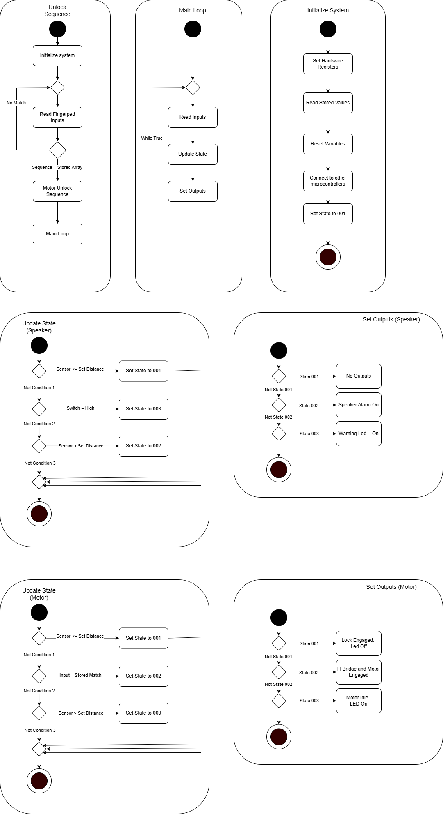

## Introduction

The door controller firmware operates as a finite-state machine (FSM) which runs inside a cooperative main loop that follows this sequence: Read Inputs → Update State → Set Outputs. The system starts its operation by setting hardware registers to their initial values and clearing all software variables and establishing communication links between MCUs through UART and I²C interfaces and then it enters State 001 (Closed). The system checks debounced sensor inputs from magnetic reed/limit switches and distance/UART and current/thermal flags and user override buttons during each cycle. The Update State routine checks transition predicates after which Set Outputs determines motor driver and indicator output values based on the current state. The design structure produces reliable operation while making testing easier and blocking any potential output irregularities.

## Research Question

* Bullet Point 1
* Bullet Point 2
* Bullet Point 3

## Images

## Logic Flow

# State Semantics
* State 001 (Closed/Locked, Idle): The motor remains disabled while the lock remains engaged and the status LED displays "closed."
* State 002 (Moving): The H-bridge enables motor operation through direction control from commands while the lock releases during movement and safety features monitor current levels and time limits and detect obstacles.
* State 003 (Open, Idle/Unlocked): The motor stays disabled while the status LED shows "open" and the auto-close timer operates in the background.

# Outputs Mapping (PIC → H-Bridge / Indicators)
* The FAN8100N receives motor direction and step logic through RD0/RD1 pins which have a truth table documented in the driver section.
* The EN pin serves as the motor enable signal which becomes active only during State 002.
* The RA1 pin functions as the primary sensor input which accepts data from reed sensors or distance triggers.
* The system displays specific LED patterns and buzzer sounds for each state and when it detects any faults.
* The Set Outputs() function contains all output writing operations to maintain centralized control and enable auditability of side effects.

# Determinism & Safety
* The system implements mechanical input debouncing with hysteresis to stop motor oscillations caused by chattering.
* The system will exit State 002 through watchdog and motion timeout mechanisms when the set limits are not achieved.
* The system performs a safe shutdown when it detects any obstructions through current and thermal monitoring systems.
* The system enables motor operation only after it detects valid sensor data and state verification during startup.

## Conclusions and Future Work

## External Links

[example link to idealab](https://idealab.asu.edu)

## Results

1. Numbered Point 1
1. Numbered Point 2
1. Numbered Point 3

## Conclusions and Future Work

## External Links

[example link to idealab](https://idealab.asu.edu)

## References

