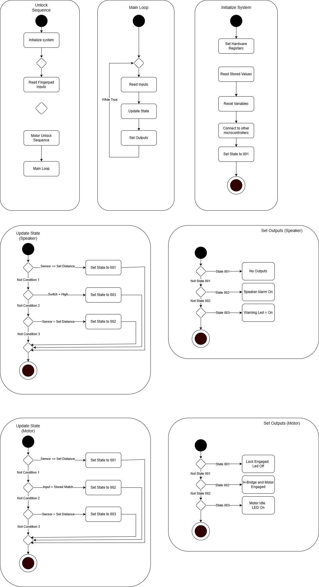

## Introduction
The Smart Door Sensor Software is designed to coordinate multiple subsystems that work together to manage door locking, unlocking, and safety monitoring. It initializes hardware registers and establishes communication between microcontrollers at startup. The system operates through simultaneous processing loops that handle tasks such as distance sensing, user input, motor control, and alarms, ensuring reliable and automated door operation.

## Images

## Logic Flow

The door controller firmware operates on a series of loops that are capable of simultaneous processing among the individual subsystems. 
The system starts its operation by setting hardware registers to their initial values and clearing all software variables, and establishing communication links between MCUs.

### IR Emitter/Detector Subsystem
The IR Emitter/Detector Subsystem initializes and runs throughout the device’s power-on time. It sends a high or low signal for wether the door is open or closed, converted from an analog reading from the sensor to a digital high/low by the ADC module in the MCU, to the other MCUs in the System

### FingerPad Subsystem 
* The Unlock Sequence works with a series of push buttons that act as a number pad that enables the user to lock and unlock the door.
* The pushbuttons, all connected to the MCU, draw a high value when pushed down. This is mapped to a character that is stored in the memory. 
* The MCU compares the sequence of characters entered against a previously stored array of characters, either from the manufacturer or during the first startup, to check if the “Password” is correct. 
If correct, the Fingerpad subsystem continues unto the main loop, else, a re-input is needed for unlock.

### Toggle Switch Semantics
This simply works as an override button. When pulled high, it disables the activities of both the Motor and Alarm Subsystem, and forces them to their low states.

### Motor Subsystem
The motor system receives a signal from the Fingerpad, Toggle switch and IR Sensor in order to changes states depending on either a locking or an unlocking sequence.

**Motor State Semantics**

- State 001 (Closed/Locked, Idle): The motor remains disabled while the lock remains engaged, and the status LED displays "closed."Here, the fingerpad array does not match, or the toggle switch is on.

- State 002 (Moving): The H-bridge enables motor operation through direction control from commands. The H-Bridge sends power to control the direction the motor spins, which decides whether it is an unlock or lock operation. All 3 conditions, IR Sensor sends an high ,fingerpad array matches, and the toggle switch is off (low), must be met.

### Alarm Subsystem
The Alarm system is enabled as soon as the subsystem's internal timer finishes counting down when the distance value exceeds the closed door value for a period of time. This Subsystem serves as a measure to ensure the door is not left open too long. It requires the IR Sensor and Toggle switch Input.

**Alarm State Semantics**

- State 001 (Closed, Idle): The alarm subsystem is idle; no components are running. Here, the IR Sensor sends a low or the toggle switch sends an high.

- State 002 (Alarm On): The timer from the motor subsystem sends a signal to the alarm subsystem after. This enables the speaker that plays the warning sound and the red LED as a visual signal for the warning. The IR Value must be high and Toggle Switch low for the alarm to run.

## Version 2.0
**Hardware V2.0**
<u>Modular System Architecture
Adopt a tree and node modular layout where major functions like power supply, audio output, relay , sensors, and communication modules are designed as separate blocks connected to a central logic MCU that does the processing. This makes it easier to isolate issues, upgrade individual components, and perform testing without affecting the entire design. It also makes logic processing and output of the entire system faster.

<u>Improved Diagnostics & LED Feedback
Include multiple debugging LEDs throughout the system to represent power status, state, sensor activity, communication status, and fault indicators. These LEDs provide instant visual confirmation of each subsystem’s behavior, greatly simplifying testing and troubleshooting.

<u>Better Power Management
Create three central rails with a voltage regulator from 12v to 9v to 5v. This helps reduce the amount of cables needed to be plugged into the entire system, reduces heat generated by the system and reduces the total cost of the system.

**Software V2.0**

## Conclusions
The decision process of the software sequence follows the same pattern as when making the block diagram. The team put together a sequence of processes to ensure feasibility of a working prototype, while using simple components and limited knowledge of such field.

